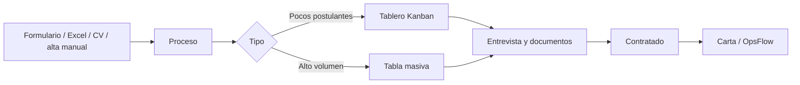
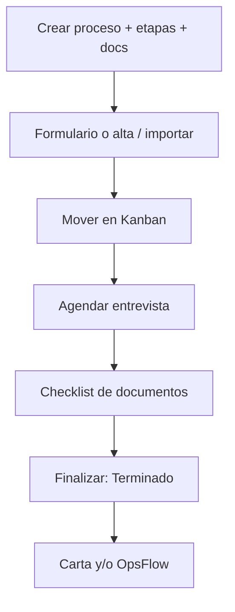

# 🗂️ Manual de Opalo ATS

> **Producto:** Opalo ATS — Applicant Tracking System  
> **Versión del manual:** 3.0 · septiembre 2026  
> **Para:** consultores, clientes, consulta y administradores  
> **Cómo leer:** use el índice, salte a su rol y abra solo el módulo que necesita.

---

## Cómo pegar este documento en Notion

1. Cree una página nueva y póngale icono `🗂️` (o el logo de Opalo).
2. Pegue este Markdown. Notion conservará títulos, tablas, listas y diagramas.
3. Opcional, para que se vea como wiki: convierta los bloques `>` en **Callout** (`/` → Callout) y los títulos largos en **Toggle heading**.
4. En la página, active **Table of contents** (bloque Índice) al inicio.

> 💡 **Tip visual:** un callout azul para “quién puede”, amarillo para advertencias y verde para flujos recomendados. Este archivo ya usa esas convenciones con emojis.

---

## Índice

1. [Mapa del producto](#1-mapa-del-producto)
2. [Qué hay de nuevo](#2-qué-hay-de-nuevo)
3. [Acceso e interfaz](#3-acceso-e-interfaz)
4. [Roles y permisos](#4-roles-y-permisos)
5. [Panel](#5-panel)
6. [Inteligencia](#6-inteligencia)
7. [Procesos (Kanban)](#7-procesos-kanban)
8. [Procesos masivos](#8-procesos-masivos)
9. [Candidatos y ficha](#9-candidatos-y-ficha)
10. [Archivados](#10-archivados)
11. [Formularios](#11-formularios)
12. [Cartas](#12-cartas)
13. [Calendario](#13-calendario)
14. [Reportes](#14-reportes)
15. [Comparador](#15-comparador)
16. [Importación](#16-importación)
17. [Envíos OpsFlow](#17-envíos-opsflow)
18. [Actividad de usuarios](#18-actividad-de-usuarios)
19. [Usuarios](#19-usuarios)
20. [Configuración](#20-configuración)
21. [Google Drive](#21-google-drive)
22. [Avisos y mensajes](#22-avisos-y-mensajes)
23. [Flujos recomendados](#23-flujos-recomendados)
24. [Preguntas frecuentes](#24-preguntas-frecuentes)
25. [Guía rápida por rol](#25-guía-rápida-por-rol)

---

## 1. Mapa del producto

Opalo ATS gestiona el reclutamiento de punta a punta: vacantes, postulantes, contacto, entrevistas, documentos y entrega a operación.



| Módulo | Para qué sirve | Quién lo usa más |
|---|---|---|
| **Panel** | KPIs del día a día | Todos |
| **Inteligencia** | Vista ejecutiva de flujo y equipo | Admin |
| **Procesos** | Vacantes con tablero Kanban | Consultor + cliente |
| **Procesos masivos** | Campañas de miles de filas | Consultor |
| **Candidatos** | Listado global y ficha | Todos |
| **Cartas / Comparador / Reportes** | Salidas para cliente o legal | Consultor + cliente |
| **OpsFlow** | Entrega de seleccionados a operación | Consultor + admin |
| **Actividad / Usuarios / Configuración** | Gobierno del sistema | Admin |

---

## 2. Qué hay de nuevo

Respecto al manual de junio 2026:

| Novedad | Dónde se ve |
|---|---|
| **Inteligencia** | Menú → Inteligencia (solo admin) |
| **Actividad de usuarios** | Pie del menú → Actividad (solo admin) |
| **Estados extra de proceso** | En Proceso · Stand By · Terminado · **Cancelado** · **Trunco** |
| **Finalizar proceso** | Elige Terminado / Cancelado / Trunco |
| **Modo tabla** | Desde un proceso Kanban, vista de alta densidad |
| **Importar CVs** | En el tablero del proceso |
| **Avisos** | Campana junto a Cerrar sesión |
| **Chat Mattermost** | Barra **Mattermost** (mismos DMs que la app de escritorio) |
| **Panel de fidelización** | En procesos masivos (llamadas, WhatsApp, correo) |
| **Trasladar candidatos** | Mover o duplicar entre procesos masivos |
| **Perfil ideal, Score IA, psicolaboral, rutas** | Herramientas de la tabla masiva |
| **Login y chat con Mattermost** | **Entrar con Mattermost**; la barra de mensajes es el mismo DM de Mattermost |

---

## 3. Acceso e interfaz

### Iniciar sesión

1. Abra la URL que le entregó su administrador.
2. Pulse **Entrar con Mattermost**.
3. Inicie sesión en Mattermost (mismo correo con el que existe en el ATS).
4. Autorice Opalo ATS. Vuelve solo al ATS.

La app de escritorio de Mattermost **no** inicia sesión en el navegador: son sesiones distintas.

> ⚠️ El alta en el ATS la hace un admin en **Usuarios**, con el **mismo correo** que en Mattermost. No hace falta conocer la clave de Mattermost: se vincula en el primer ingreso.
>
> El **Acceso local de emergencia** (correo + clave local) es solo si Mattermost está caído. Esa clave no es la de Mattermost y **no abre el chat**.
>
> Si olvidó la clave de Mattermost, recupérela en Mattermost. El admin no la conoce ni la guarda.

### Menú lateral

El menú solo muestra las secciones habilitadas para su usuario. El administrador puede renombrar etiquetas en **Configuración → UI Labels**.

| Orden | Sección | Función |
|---|---|---|
| 1 | **Panel** | Estadísticas y gráficos |
| 2 | **Inteligencia** | KPIs ejecutivos (admin) |
| 3 | **Procesos** | Tablero Kanban |
| 4 | **Procesos Masivos** | Tabla de alto volumen |
| 5 | **Archivados** | Candidatos fuera del pipeline activo |
| 6 | **Candidatos** | Listado global |
| 7 | **Envíos OpsFlow** | Historial de paquetes enviados |
| 8 | **Formularios** | Integraciones (Tally, Google Forms, etc.) |
| 9 | **Cartas** | Documentos Word con campos dinámicos |
| 10 | **Calendario** | Entrevistas |
| 11 | **Reportes** | Exportación |
| 12 | **Comparador** | Comparación visual |

**Pie del menú (admin):** Actividad · Usuarios · Configuración

**Siempre visibles en el pie:**

| Control | Qué hace |
|---|---|
| **Colapsar** (‹ ›) | Deja solo iconos |
| **Actualizar** | Recarga procesos y candidatos |
| **Avisos** (campana) | Alertas de contacto y postulantes |
| **Cerrar sesión** | Sale de la cuenta |
| **POWERED BY** | Logo opcional de marca |

En **móvil**, el botón hamburguesa (esquina superior izquierda) abre el menú.

---

## 4. Roles y permisos

| Rol en pantalla | Código | Idea |
|---|---|---|
| **Admin (Edición)** | `admin` | Acceso total, gobierno e Inteligencia |
| **Recruiter (Consultor)** | `recruiter` | Operación diaria de procesos y candidatos |
| **Client (Cliente)** | `client` | Revisa y mueve candidatos visibles |
| **Viewer (Consulta)** | `viewer` | Solo lectura |

### Qué ve cada rol por defecto

| Sección | Admin | Consultor | Cliente | Consulta |
|---|:---:|:---:|:---:|:---:|
| Panel | ✅ | ✅ | ✅ | ✅ |
| Inteligencia | ✅ | — | — | — |
| Procesos | ✅ | ✅ | ✅ | ✅ |
| Procesos masivos | ✅ | ✅ | — | — |
| Archivados | ✅ | ✅ | — | — |
| Candidatos | ✅ | ✅ | ✅ | ✅ |
| Envíos OpsFlow | ✅ | ✅ | — | — |
| Formularios | ✅ | ✅ | — | — |
| Cartas | ✅ | ✅ | — | — |
| Calendario | ✅ | ✅ | ✅ | ✅ |
| Reportes | ✅ | ✅ | ✅ | ✅ |
| Comparador | ✅ | ✅ | ✅ | — |
| Actividad | ✅ | — | — | — |
| Usuarios | ✅ | — | — | — |
| Configuración | ✅ | — | — | — |

> 💡 El admin puede **personalizar** secciones y permisos por usuario. Además, puede limitar a un usuario a **clientes específicos** (razón social / RUC).

### Permisos granulares

Al crear o editar un usuario:

| Categoría | Permisos |
|---|---|
| Procesos | Ver · Crear · Editar · Eliminar |
| Candidatos | Ver · Crear · Editar · Eliminar · Archivar · Exportar |
| Calendario | Ver · Crear · Editar · Eliminar |
| Reportes | Ver · Exportar |
| Usuarios | Ver · Crear · Editar · Eliminar |
| Configuración | Ver · Editar |
| Cartas y documentos | Ver · Crear · Descargar |
| Comparador | Ver · Exportar |
| Formularios | Ver · Editar |

### Visibilidad para clientes

En la ficha del candidato hay el interruptor **Visible para clientes/viewers**.

Los roles **Cliente** y **Consulta** solo ven candidatos con esa opción activa (en listados, tablero, dashboard y comparador).

El **Cliente** sí puede **arrastrar candidatos** entre etapas del Kanban. No puede crear, editar ni eliminar procesos o postulantes.

---

## 5. Panel

**Menú → Panel**

Vista analítica del reclutamiento. Use **Actualizar** en el menú o el botón de refresco del propio panel si necesita datos al momento.

### Filtros

| Filtro | Uso |
|---|---|
| **Tipo de proceso** | Todos / solo masivos / solo regulares |
| **Proceso** | Una vacante concreta |
| **Postulación desde / hasta** | Recorta por fecha de alta |

### Tarjetas de resumen

- Procesos activos (masivos vs regulares)
- Candidatos en alcance
- Descartados
- Contratados

Más abajo hay bloques de **eficiencia**, **canales de atención** (llamadas, WhatsApp, correo), **generación de registros**, **agendamiento de citas**, fuentes, edad, ubicaciones y próximas entrevistas.

> Si no hay datos para los filtros, verá *Sin datos para los filtros seleccionados*.

---

## 6. Inteligencia

**Menú → Inteligencia** · solo **admin**

Vista ejecutiva del flujo de postulantes, el desempeño del equipo y la salud de la cartera.

| Control | Qué hace |
|---|---|
| Periodo | Última semana · último mes · último año |
| **Actualizar** | Recalcula KPIs y gráficos |
| Filtro de estado | En la tabla de procesos |

### KPIs

| Tarjeta | Qué muestra |
|---|---|
| **Nuevos postulantes** | Ingresos del periodo y promedio diario |
| **Llamadas del equipo** | Volumen y quién tiene mayor efectividad |
| **Contrataciones** | Total y quién lidera |
| **Cartera de procesos** | En proceso / Stand By / terminados |

### Bloques

- **Flujo diario de nuevos postulantes** — compara hasta 8 procesos con más ingreso.
- **Desempeño por usuario** — llamadas, efectividad, interés, desistimientos y contrataciones.
- **Tabla de procesos** — ordenable: nuevos/hora, desistimientos, traslados, conversión, tasa de contacto.

---

## 7. Procesos (Kanban)

**Menú → Procesos**

Cada proceso es una vacante con columnas = etapas. Los procesos marcados como masivos **no** aparecen aquí.

### Lista

Cada tarjeta muestra flyer, título, estado, cantidad de candidatos, vacantes, fechas y una alerta ámbar si hay candidatos en **etapas críticas** sin revisar.

**Filtros de estado**

| Estado | Significado | ¿Genera alertas e indicadores? |
|---|---|---|
| 🟢 **En Proceso** | Operación activa | Sí |
| 🟡 **Stand By** | Pausado; sigue visible y se puede trabajar | No |
| ⚫ **Terminado** | Cerrado con contratados | No |
| 🔴 **Cancelado** | No continúa y no se factura | No |
| 🟠 **Trunco** | No continúa; facturación parcial | No |

| Botón | Función |
|---|---|
| **Nuevo Proceso** | Crea un proceso vacío |
| **Buscar** | Filtra por nombre |
| **Recargar** | Refresca la lista |
| Menú **⋮** | Ver · Editar · Duplicar · Eliminar · Reactivar |

> ⚠️ **Duplicar** copia configuración y etapas, no los candidatos. **Eliminar** borra el proceso y **todos** sus candidatos. No se puede deshacer.

### Crear / editar proceso

| Campo | Para qué |
|---|---|
| Título, descripción | Nombre y detalle del puesto |
| Cliente | Empresa del catálogo (Configuración) |
| Código OS | Orden de servicio |
| Rango salarial / experiencia / seniority | Referencia del perfil |
| Fechas y vacantes | Planificación |
| Estado | En proceso, Stand By, Terminado, Cancelado, Trunco |
| Flyer | Portada; se puede ajustar la posición de la imagen |
| Etapas | Nombre, color, orden; marcar **crítica** o **requerida para avanzar** |
| Categorías de documentos | CV, DNI, etc. por etapa |
| Carpeta Google Drive | Destino de adjuntos |
| Adjuntos del proceso | Bases, perfiles, JD |

### Tablero

| Botón | Cuándo aparece | Función |
|---|---|---|
| **←** | Siempre | Vuelve a la lista |
| **Performance** | Siempre | Informe de cobertura y desempeño |
| **Emitir cartas** | Con candidatos seleccionados | Cartas masivas |
| **Comunicar** | Con selección | Email / WhatsApp a esos candidatos |
| **Comunicación masiva** | Admin / consultor | Mensaje al grupo del proceso |
| **Finalizar proceso** | Si está operativo | Terminado / Cancelado / Trunco |
| **Gestionar candidatos contratados** | Si está Terminado | Ajusta la lista de contratados |
| **Ver documentos** | Admin / consultor | Adjuntos del proceso |
| **Editar proceso** | Admin / consultor | Abre el editor |
| **Reactivar a En Proceso** | Si no está activo | Vuelve a generar alertas e indicadores |
| **Modo tabla** | Si el proceso lo soporta | Vista de alta densidad (tipo masivo) |
| **Importar candidatos** | Proceso activo | Excel |
| **Importar CVs** | Proceso activo | Alta desde archivos CV |
| **Añadir candidato** | Proceso operativo | Alta manual |

**Por columna:** contador y **Descargar** (Excel de esa etapa).

**Mover candidatos:** arrastre la tarjeta. El historial guarda usuario y fecha. El sistema puede bloquear el movimiento si faltan documentos requeridos para la etapa destino.

### Tarjeta en el tablero

| Elemento | Función |
|---|---|
| Checkbox | Selección para cartas o comunicación |
| Clic | Abre la ficha |
| Post-it | Notas de color; borde amarillo = hay notas |
| Descartar | Marca descartado con motivo |
| Teléfono | Copiar, llamar, WhatsApp mensaje / llamada |

### Finalizar proceso

Al pulsar **Finalizar proceso** elija un desenlace:

| Opción | Cuándo usarla |
|---|---|
| **Terminado** | Hubo contratados. Después selecciona los finalistas. |
| **Cancelado** | El proceso no continúa y no se factura. |
| **Trunco** | El proceso no continúa, pero hay facturación parcial. |

Stand By, Cancelado y Trunco **siguen visibles** en la lista para consultarlos o reactivarlos. No disparan avisos ni cuentan en indicadores hasta volver a **En Proceso**.

---

## 8. Procesos masivos

**Menú → Procesos Masivos**

Para campañas de **alto volumen**: tabla editable, contactología, rutas, perfil ideal, evaluación psicolaboral y OpsFlow.

> Los procesos con marca masiva solo viven aquí, no en el Kanban.

### Lista

- **Nuevo Proceso Masivo**
- Mismos filtros de estado que procesos regulares
- Stand By y cerrados siguen visibles; no generan alertas hasta reactivarlos

### Barra de la tabla

Tres grupos:

**Proceso**

| Botón | Función |
|---|---|
| Editar Proceso | Configuración, columnas, etapas, cliente, flyer |
| Reactivar a En Proceso | Si estaba pausado o cerrado |
| Documentos | Adjuntos compartidos |

**Tabla**

| Botón | Función |
|---|---|
| Deshacer (`Ctrl+Z`) | Revierte ediciones de celdas |
| Agregar columna | Texto, número, fecha, lista, etc. |
| Gestionar columnas | Renombrar, tipo, opciones |
| Plantillas | Guardar / cargar diseño |
| Restaurar diseño | Recupera orden, ocultas y fijadas **sin borrar candidatos** |
| Recuperar datos | Restaura valores desde el navegador o JSON |
| Columnas | Mostrar, ocultar, fijar a la izquierda |
| Añadir fila | Nuevo candidato |
| Importar | Excel o CVs |
| Exportar | Excel para el cliente |
| Normalizar / corregir mayúsculas | Limpia texto |
| Costos / recalcular rutas | Transporte público |
| Actualizar | Recarga desde el servidor |

**Herramientas**

| Botón | Función |
|---|---|
| **Trasladar** | Mover o duplicar filas a otro proceso masivo |
| Historial | Bitácora de cambios del proceso |
| Panel fidelización | Rail de llamadas / WhatsApp / correo |
| Mensajes contacto | Plantillas de email y WhatsApp |
| Documentación | Plantillas Word por candidato |
| Tarifas transporte | Precios de pasajes |
| Estadísticas / Performance | Gráficos del proceso |
| Perfil ideal | Criterios y % de match |
| Inventario / Evaluar masivo / Informe psico. | Si el módulo psicolaboral está activo |

También hay **pines de información** (notas fijadas en la barra) y **respuestas rápidas** / portapapeles.

### Cómo trabajar la tabla

| Acción | Cómo |
|---|---|
| Editar celda | Doble clic o Enter |
| Selección | `Ctrl`+clic · `Shift`+arrastrar |
| Copiar / pegar | `Ctrl+C` / `Ctrl+V` (bloques tipo Excel) |
| Color o comentario | Clic derecho |
| Ancho de columna | Arrastrar el borde del encabezado |
| Detalle | Doble clic en la fila (panel lateral) |

### Contactología

En Email / WhatsApp / Llamada:

- Semáforo de estado (sin contactar, en intento, contactado, no contesta…)
- Registro de intentos
- Acceso rápido a WhatsApp o correo
- Revertir última acción o reiniciar el canal
- **Bloqueo de contacto:** mientras un consultor gestiona a alguien, otro no lo pisa; al expirar, el aviso **Bloqueo expirado** indica que se puede recontactar

Con filas seleccionadas aparecen acciones flotantes: WhatsApp, Email, Informe psicolaboral, OpsFlow, Trasladar.

---

## 9. Candidatos y ficha

**Menú → Candidatos**

Listado global (filtrado por cliente y por visibilidad si aplica).

| Acción | Función |
|---|---|
| Buscar | Nombre, email, teléfono |
| Filtros | Proceso / etapa |
| Abrir | Misma ficha que en el tablero |
| **Enviar a OpsFlow** | Admin / consultor, con selección |

### Ficha — barra superior

| Botón | Función |
|---|---|
| Exportar ZIP | Foto, datos y adjuntos |
| Enviar a OpsFlow | Paquete de alta a operación |
| Archivar / Restaurar | Saca o devuelve al pipeline |
| Descartar | Sale del proceso activo con motivo |
| Eliminar | Borrado permanente (con confirmación) |
| Mover / Duplicar | Cambia de proceso o copia |
| Editar | Modo edición de campos |
| Selector de etapa | Cambia etapa sin arrastrar |

### Pestañas

| Pestaña | Contenido |
|---|---|
| **Detalles** | Datos personales, fuente, salarios, resumen, interruptor *Visible para clientes*, ficha complementaria, foto, adjuntos, Drive, **rutas en transporte público**, Score IA si aplica |
| **Historial** | Movimientos de etapa (quién / cuándo) y envíos OpsFlow |
| **Agenda** | Entrevistas: crear, editar, eliminar |
| **Comentarios** | Hilo interno; se pueden adjuntar imágenes |
| **Documentos** | Checklist por categorías del proceso |

**Contacto rápido en Detalles:** copiar teléfono, llamar, WhatsApp.

---

## 10. Archivados

**Menú → Archivados**

Candidatos fuera del tablero activo. No entran en conteos activos del Panel.

| Acción | Función |
|---|---|
| Buscar | Localiza archivados |
| Abrir ficha | Todos los datos |
| Restaurar | Vuelve al proceso |
| Eliminar | Borrado permanente |

---

## 11. Formularios

**Menú → Formularios**

Conecta un formulario externo para que cada envío **cree o actualice** candidatos.

| Campo | Función |
|---|---|
| Nombre | Identificación interna |
| Plataforma | Tally, Google Forms, Microsoft Forms, otro |
| Proceso asociado | Destino (normal o masivo) |
| URL | Enlace público |
| Webhook / clave | Recepción segura |
| Mapeo | Qué respuesta llena nombre, email, teléfono, etc. |

Tras guardar, las postulaciones caen en la **etapa inicial** del proceso.

> Eliminar la integración en el ATS **no** borra el formulario en Tally o Google.

---

## 12. Cartas

**Menú → Cartas**

Genera `.docx` desde plantillas con campos tipo `{{Nombre}}`, `{{Email}}`, `{{Puesto}}`.

1. **Nueva carta** o, desde el tablero, **Emitir cartas** (selección múltiple).
2. Elija candidato(s).
3. Suba o elija plantilla Word.
4. Revise campos detectados y valores.
5. **Generar y descargar** — si Drive está conectado, se guarda copia en la carpeta **Cartas**.

---

## 13. Calendario

**Menú → Calendario**

| Función | Descripción |
|---|---|
| Vistas | Mes / semana / día |
| Crear | Clic en una franja o botón nuevo |
| Editar | Clic en el evento |
| Filtros | Proceso, entrevistador, candidato |
| Exportar `.ics` | Outlook / Google Calendar |
| Invitación por email | Si está habilitada |

Las entrevistas creadas en la pestaña **Agenda** de la ficha también aparecen aquí.

---

## 14. Reportes

**Menú → Reportes**

| Bloque | Qué exporta |
|---|---|
| Todos los candidatos | Columnas a elección (nombre, proceso, etapa, correo, teléfonos, fuente, salarios, DNI, LinkedIn, ubigeo…) |
| Resumen de procesos | Vista agregada de vacantes |

Seleccione columnas → **Descargar**. Requiere permiso `reports.export` para exportar.

---

## 15. Comparador

**Menú → Comparador**

Compara **dos o más** candidatos lado a lado.

| Acción | Función |
|---|---|
| Nueva comparación | Lienzo vacío |
| Agregar candidatos | Desde la base |
| Agregar widget | Barras, líneas, radar, torta, área, tabla o lista |
| Datos manuales | Criterios que no están en el sistema |
| Exportar PDF / Word | Informe con colores y pie de **Configuración** |

Si Drive está activo, los PDF se guardan en **Reportes**.

---

## 16. Importación

La importación **ya no tiene ítem propio en el menú**. Se abre desde el proceso.

### Procesos regulares (Kanban)

1. Abra el proceso.
2. **Importar candidatos** (Excel) o **Importar CVs**.
3. En Excel: descargue plantilla → complete (mínimo nombre, email) → mapee columnas → revise errores → importe.
4. Los candidatos entran en la primera etapa.

### Procesos masivos

Use **Importar** dentro de la tabla (Excel o CVs) o restaure desde un Excel original.

---

## 17. Envíos OpsFlow

**Menú → Envíos OpsFlow**

Historial de paquetes enviados al sistema operativo **OpsFlow**.

| Estado de entrega | Significado |
|---|---|
| **pending** | Guardado; entrega en curso o pendiente |
| **delivered** | OpsFlow confirmó recepción |
| **failed** | Error de red o configuración → **Reintentar** |

Desde la ficha o la tabla masiva: **Enviar a OpsFlow** → complete datos de entrega y nota al receptor.

Puede enviarse como **presentación** (entrevista con área usuaria) o **contratación**, e incluye ficha complementaria si el candidato la completó.

---

## 18. Actividad de usuarios

**Menú (pie) → Actividad** · solo **admin**

Auditoría de ingresos e interacciones.

| Control | Uso |
|---|---|
| **Hoy / 7 días / 30 días** | Recorte temporal (zona Lima) |
| Buscar | Texto en el resumen del evento |
| Usuario / categoría | Filtros |
| Clic en un usuario | Historial detallado |

### KPIs

- **Ingresos** — logins y usuarios distintos
- **Activos ahora** — actividad en los últimos 15 minutos
- **Eventos** — volumen del periodo

### Categorías

Sesión · Navegación · Candidatos · Contacto · Procesos masivos · Procesos · Calendario · Notas y comentarios · Mensajería · Documentos y OpsFlow · Configuración · Usuarios

> Si aparece un aviso de migración, el registro aún no está habilitado en la base. Contacte a soporte técnico.

---

## 19. Usuarios

**Menú → Usuarios** · admin

| Acción | Función |
|---|---|
| Nuevo Usuario | Alta de cuenta |
| Editar | Datos, rol, permisos, secciones, clientes, avatar, clave local opcional |
| Eliminar | Quita el acceso; el historial queda como “usuario eliminado” |

**Cómo dar de alta a alguien**

1. Créelo primero en Mattermost (si aún no existe).
2. En el ATS: **Usuarios → Añadir**, con el **mismo correo**.
3. No ponga la clave de Mattermost (usted no la tiene). Deje la contraseña local vacía.
4. La primera vez que esa persona pulse **Entrar con Mattermost**, el ATS la vincula. En la lista pasará de *Pendiente del primer ingreso* a `@usuario`.

La **contraseña local** es opcional y solo sirve para el acceso de emergencia. No sincroniza con Mattermost.

Al cambiar el **rol**, se recargan permisos y secciones por defecto; después puede personalizarlos.

**Acceso a clientes:** si completa `allowedClientIds`, el usuario solo ve procesos de esas empresas.

---

## 20. Configuración

**Menú → Configuración** · admin

Pantalla única con **Save Changes / Guardar cambios** al final.

| Bloque | Qué controla |
|---|---|
| **Branding** | Nombre de la app, logo, logo POWERED BY |
| **Informe (PDF)** | Colores, portada, pie; subbloque **Informe psicolaboral** |
| **Fuentes de candidatos** | Lista del campo Fuente (una por línea) |
| **Clientes** | Razón social y RUC |
| **Sedes de entrevista** | Destinos para calcular rutas |
| **Provincias y distritos** | Listas al editar candidatos |
| **UI Labels** | Textos del menú y de algunas pantallas |
| **Localization** | Símbolo de moneda (`S/`, `$`…) |
| **Database Connection** | Referencia informativa |
| **Almacenamiento / Google Drive** | Ver [sección 21](#21-google-drive) |

---

## 21. Google Drive

Recomendado para adjuntos, cartas y reportes. Si no está conectado, los archivos se guardan en base de datos (con límite de tamaño).

```
[Carpeta raíz]
├── [Proceso A]
│   ├── [Candidato 1]
│   └── [Documentos del proceso]
├── Cartas
└── Reportes
```

| Botón (Configuración) | Función |
|---|---|
| Guardar credenciales | Client ID y Secret |
| Conectar Google Drive | OAuth en ventana emergente |
| Seleccionar carpeta raíz | Base del ATS |
| Actualizar carpetas | Refresca el listado |
| Desconectar | Deja de subir archivos nuevos; los existentes permanecen en Drive |

En la ficha del candidato, **Sincronizar desde Google Drive** trae archivos que se subieron directo a la carpeta.

---

## 22. Avisos y mensajes

### Avisos (campana)

Junto a Cerrar sesión. Al hacer clic en un aviso abre el proceso correspondiente.

| Aviso | Significado |
|---|---|
| Candidatos sin ningún intento de contacto | Nadie los ha tocado aún |
| Tu gestión sin seguimiento (+1 h) | Llevan más de una hora sin nuevo intento |
| Bloqueo expirado — puedes recontactar | Ya se puede volver a contactar |
| Sin candidatos nuevos en el proceso | No ingresan postulantes hace ≥ 1 h (masivos) |

### Mensajes (Mattermost)

Barra **Mattermost** (esquina). Es el mismo chat directo de Mattermost: lo que envía o recibe aquí aparece en la app de escritorio y en la web de Mattermost, y al revés.

Solo está disponible si entró con **Entrar con Mattermost**. No hay un chat interno aparte del ATS.

No reemplaza WhatsApp ni el correo al candidato; es coordinación interna del equipo.

---

## 23. Flujos recomendados

### Reclutamiento estándar



- [ ] Crear proceso con etapas y documentos requeridos
- [ ] Publicar formulario o añadir / importar candidatos
- [ ] Mover tarjetas según avance
- [ ] Agendar desde ficha o Calendario
- [ ] Completar checklist
- [ ] Marcar **Visible para clientes** cuando el cliente deba opinar
- [ ] Finalizar y, si aplica, enviar a OpsFlow

### Campaña masiva

- [ ] Crear proceso masivo y plantilla de columnas
- [ ] Importar Excel / CVs o conectar formulario
- [ ] Trabajar contactología (Panel fidelización + plantillas)
- [ ] Filtrar, perfil ideal, Score IA
- [ ] Agendar desde columnas de fecha
- [ ] Aprobar / rechazar; exportar al cliente
- [ ] Trasladar o enviar a OpsFlow a los seleccionados

### Cliente externo

- [ ] El consultor marca **Visible para clientes**
- [ ] El cliente entra a **Procesos**, revisa el tablero y **arrastra** según su evaluación
- [ ] Usa Comparador y Reportes; no crea ni elimina
- [ ] Las **etapas críticas** generan alerta hasta que un cliente abre la ficha (un admin o consultor que revise no apaga esa alerta)

---

## 24. Preguntas frecuentes

**¿Por qué no veo una sección?**  
Su rol no la incluye, o el admin la ocultó en **Secciones visibles**. Inteligencia y Actividad son exclusivas de admin.

**¿Por qué el cliente no ve a un candidato?**  
Active **Visible para clientes/viewers** y verifique que el usuario no esté restringido a otros clientes.

**¿Kanban o masivo?**  
Kanban = pocos postulantes, etapas visuales. Masivo = miles de filas, contacto y columnas dinámicas. Un proceso Kanban puede pasar a **Modo tabla** si el volumen crece.

**¿Puedo recuperar un archivado?**  
Sí: **Archivados** → ficha → **Restaurar**.

**¿El envío a OpsFlow falló?**  
**Envíos OpsFlow** → paquete *failed* → **Reintentar**.

**¿Cómo refresco sin recargar el navegador?**  
**Actualizar** en el pie del menú.

**¿Stand By, Cancelado y Trunco desaparecen?**  
No. Siguen en la lista. Use **Reactivar a En Proceso** para volver a operar.

**¿Cómo doy de alta a alguien si no sé su clave de Mattermost?**  
No la necesita. Créelo en **Usuarios** con el mismo correo. La clave es la de Mattermost; se vincula al primer **Entrar con Mattermost**.

**¿Cómo cambio la contraseña de alguien?**  
La de Mattermost se recupera en Mattermost. La clave local de emergencia (opcional) la cambia el admin en **Usuarios** → Editar.

---

## 25. Guía rápida por rol

### Consultor

Operación del día: procesos, masivos, contacto, cartas, calendario, OpsFlow.  
No ve Usuarios, Configuración, Inteligencia ni Actividad.

**Atajos mentales**

1. Empiece por la **campana de avisos**.
2. En masivos, trabaje el **Panel fidelización** y no deje gestiones +1 h.
3. Antes de mover etapa, revise **Documentos**.
4. Marque visibilidad al cliente solo cuando el perfil esté presentable.

### Cliente

Ve Panel, Procesos, Candidatos, Calendario, Reportes y Comparador.  
Puede mover candidatos en el Kanban. No crea ni edita fichas, no sube documentos, no descarta ni archiva.

Si no puede mover a alguien: casi siempre faltan documentos de la etapa destino. Pida al consultor que complete el checklist.

### Consulta (Viewer)

Solo lectura. Ideal para dirección o auditoría. No mueve etapas ni exporta el comparador.

### Administrador

Todo lo anterior, más:

1. Crear usuarios con el rol mínimo necesario.
2. Restringir por cliente cuando haya varios mandantes.
3. Conectar Drive y sedes de entrevista.
4. Revisar **Inteligencia** (flujo y equipo) y **Actividad** (quién entra y qué hace).
5. Cerrar o reactivar procesos con el estado correcto (Terminado / Cancelado / Trunco / Stand By).

---

## Soporte

Para incidencias, envíe:

- Rol y correo del usuario
- Pantalla y proceso
- Pasos para reproducir
- Captura
- Mensaje de error (F12 → Consola, si es posible)

Contacte al administrador de su instancia o al equipo Opalo ATS.

---

*Manual 3.0 · septiembre 2026 · alineado con la interfaz actual de Opalo ATS.*
